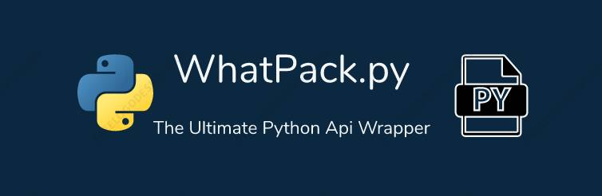

# WhatPack.py

whatpack.py is a Python package that allows you to automate WhatsApp and YouTube tasks in an asynchronous and headless way. It uses asyncpywhatkit and headlesspywhatkit libraries under the hood to provide fast and easy-to-use features. With whatpack.py, you can send messages on WhatsApp without opening the app

## Contributing

Contributions are always welcome!

See `contributing.md` for ways to get started.

Please adhere to this project's `code of conduct`.

## FAQ

#### I am getting error what should i do

Step 1:use command `pip install --upgrade whatpack.py`

step 2:check examples in examples folder

step 3:open an issue in github

#### it is not working in linux

check if all required dependencies are ready
and open issues 

#### it is not working in windows

check if all required dependencies are ready
and open issues

